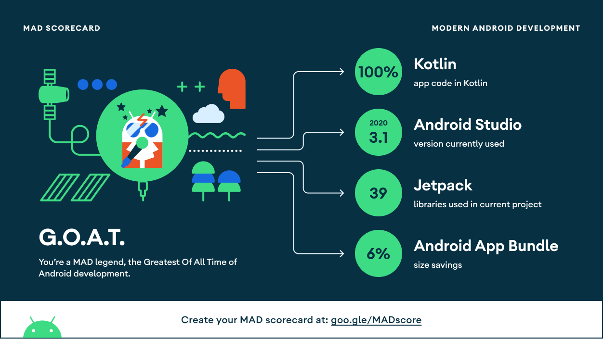

## Design Principles
- [Elegant Objects (EO)](https://www.elegantobjects.org/).
- [S.O.L.I.D](https://en.wikipedia.org/wiki/SOLID).
- [The Clean Architecture](https://blog.cleancoder.com/uncle-bob/2012/08/13/the-clean-architecture.html).
 

## Testing Principles
If you expect me to write tests for every class in isolation, in all respect, <b>I don't do that</b>. Why?
- We don't capture the behavior of our application we want to preserve.
- We can't refactor easily because implementation details are exposed to tests.
- Focusing on methods creates tests that are hard to maintain.
 

Instead, I do black-box testing. My definition of unit test is the exports from a module, in this case I'm building mobile app with user interface as the contract exposed to the world. Hence, `UI.kt` as my sole SUT. With this,
- The tests are stable, implementation detail-agnostic, changes if the domain/ behavior is requested to change.

For details, I highly recommend the followings:
 
https://dagger.dev/hilt/testing-philosophy.html
 
https://www.youtube.com/watch?v=EZ05e7EMOLM

- Also, NO mocking framework! Only fake type for test doubles purpose. The flow execution for production side has to be natural, comprehensive, which explains the code coverage is about 30% with only 2 tests :)

Try running the tests via `./gradlew jacocoTestReport`.

## Stacks
#### Foundation
- [Coroutines](https://developer.android.com/kotlin/coroutines) - Performing asynchronous code with sequential manner. 
- [Dagger Hilt](https://developer.android.com/training/dependency-injection/hilt-android) - The DI framework w/ Jetpack integration.
- [DataStore](https://developer.android.com/topic/libraries/architecture/datastore) - Latest protocol for key-value pairs storage solution.
- [Flow](https://developer.android.com/kotlin/flow) - Reactive streams based on coroutines, just like Rx. But simpler.
- [Fragment](https://developer.android.com/guide/fragments) - The UI screen.
- [Lifecycle](https://developer.android.com/topic/libraries/architecture/coroutines) - Coroutines respects over Android's component lifecycle.
- [Navigation component](https://developer.android.com/guide/navigation/navigation-getting-started) - The key player for adopting single-activity architecture with ease.
- [Room](https://developer.android.com/training/data-storage/room) - ORM for SQLite database. Also, try out its integration with [Database Inspector](https://developer.android.com/studio/inspect/database).   
- [View Binding](https://developer.android.com/topic/libraries/view-binding) - Providing safe access to view. 
- [ViewModel](https://developer.android.com/topic/libraries/architecture/viewmodel) - The presenter with its semi data persistence behavior.

#### UI
- [ConstraintLayout](https://developer.android.com/reference/androidx/constraintlayout/widget/ConstraintLayout) - Helping me manage positioning & alignment with ease. 
- [Material Components](https://github.com/material-components/material-components-android) - Helping me present Material Design.

#### Remote
- [OkHttp](https://square.github.io/okhttp) - Request interceptor. Pipeline before remote API call.
- [Retrofit](https://square.github.io/retrofit) - The HTTP REST client.

#### Testing
- [Espresso](https://developer.android.com/training/testing/espresso) - For asserting UI.
- [Hilt Testing](https://developer.android.com/training/dependency-injection/hilt-testing) - Swapping production dependencies with test doubles. 

#### Health
- [Flipper](https://fbflipper.com/) - Mobile debugger in advanced.
- [LeakCanary](https://square.github.io/leakcanary) (Debug) - Memory leak detector.
- [StrictMode](https://developer.android.com/reference/android/os/StrictMode) (Debug) - Tool for checking if any *should-be-background* operation is done on main thread.
 

## MAD Scorecard

 
 

## Architecture
Currency Converter adopts [MVVM](https://en.wikipedia.org/wiki/Model%E2%80%93view%E2%80%93viewmodel) with [Unidirectional flow (UDF)](https://en.wikipedia.org/wiki/Unidirectional_Data_Flow_(computer_science)) pattern.

## How to run
* Set `API_KEY` key in `gradle.properties` file (either in your user home directory or in the project's root folder) with the [free API Access Key](https://currencylayer.com/documentation).
